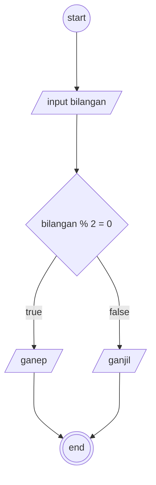

## Flowchart menentukan bilangan ganjil atau genap

```mermaid
flowchart TB
a((start))---> b[/input bilangan/]
b--->c{bilangan % 2 = 0}
c--->|true|e[/ganep/]
c--->|false|d[/ganjil/]
e--->f(((end)))
d--->f
```
