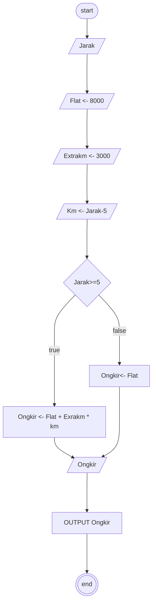

# cek ongkir

```mermaid
flowchart TB
a([start])-->b[/Jarak/]--->c[/Flat <- 8000/]--->d[/Extrakm <- 3000/]--->e[/Km <- Jarak-5/]--->f{Jarak>=5}--->|true|g[Ongkir <- Flat + Exrakm * km ]
f--->|false|h[ Ongkir<- Flat]
g-->i[/Ongkir/]
h--->i
i--->j[OUTPUT Ongkir]
j--->k(((end)))
```
