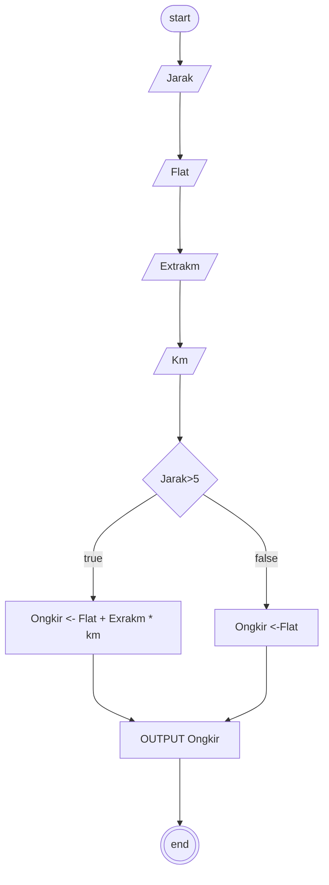

# cek ongkir

```mermaid
flowchart TB
a([start])-->b[/Jarak/]--->c[/Flat/]--->d[/Extrakm/]--->e[/Km/]--->f{Jarak>5}--->|true|g[Ongkir <- Flat + Exrakm * km ]
f--->|false|h[Ongkir <-Flat]
g--->j[OUTPUT Ongkir]
h--->j
j--->l(((end)))
```
