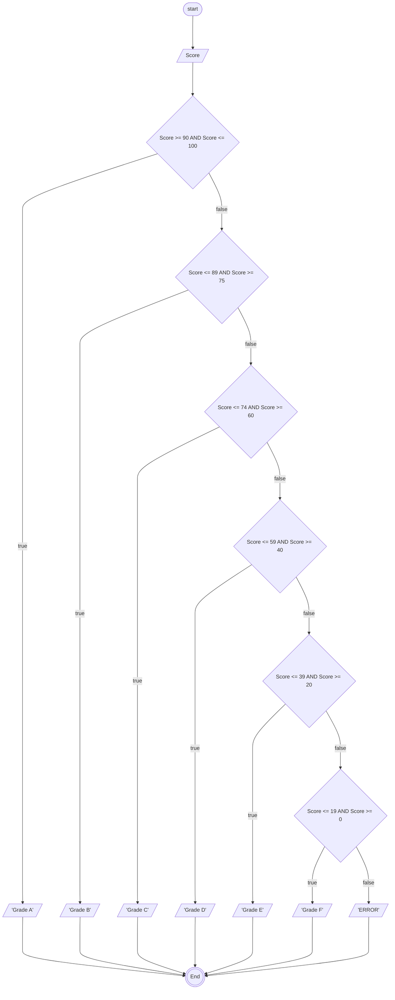

## program pembuat nilai

```mermaid
flowchart TB
1([start])
nilai[/Score/]
a[/"'Grade A'"/]
b[/"'Grade B'"/]
c[/"'Grade C'"/]
d[/"'Grade D'"/]
e[/"'Grade E'"/]
f[/"'Grade F'"/]
g[/"'ERROR'"/]

a1{Score >= 90 AND Score <= 100}
b1{Score <= 89 AND Score >= 75}
c1{Score <= 74 AND Score >= 60}
d1{Score <= 59 AND Score >= 40}
e1{Score <= 39 AND Score >= 20}
f1{Score <= 19 AND Score >= 0}

1--->nilai
nilai--->a1--->|true|a
a1--->|false|b1--->|true|b
b1--->|false|c1--->|true|c
c1--->|false|d1--->|true|d
d1--->|false|e1--->|true|e
e1--->|false|f1--->|true|f
f1--->|false|g

a---->0
b---->0
c---->0
d---->0
e---->0
f---->0
g---->0(((End)))
```
