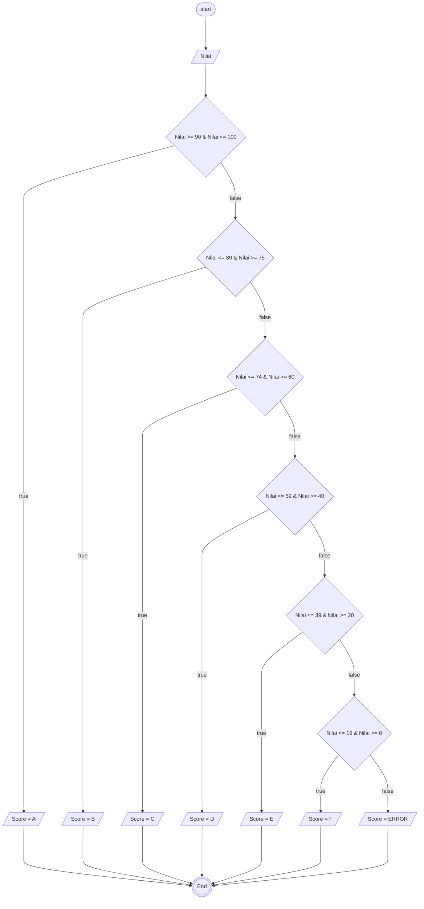

## program pembuat nilai

```mermaid
flowchart TB
1([start])
nilai[/Nilai/]
a[/Score = A/]
b[/Score = B/]
c[/Score = C/]
d[/Score = D/]
e[/Score = E/]
f[/Score = F/]
g[/Score = ERROR/]

a1{Nilai >= 90 & Nilai <= 100}
b1{Nilai <= 89 & Nilai >= 75}
c1{Nilai <= 74 & Nilai >= 60}
d1{Nilai <= 59 & Nilai >= 40}
e1{Nilai <= 39 & Nilai >= 20}
f1{Nilai <= 19 & Nilai >= 0}

1--->nilai
nilai--->a1--->|true|a
a1--->|false|b1--->|true|b
b1--->|false|c1--->|true|c
c1--->|false|d1--->|true|d
d1--->|false|e1--->|true|e
e1--->|false|f1--->|true|f
f1--->|false|g

a---->0
b---->0
c---->0
d---->0
e---->0
f---->0
g---->0(((End)))
```
