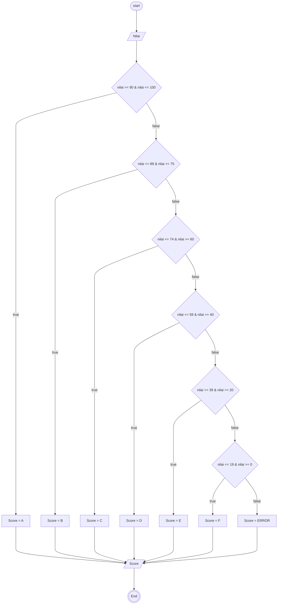

## program pembuat nilai

```mermaid
flowchart TB
1([start])
nilai[/Nilai/]
hasil[/Score/]
a[Score = A]
b[Score = B]
c[Score = C]
d[Score = D]
e[Score = E]
f[Score = F]
g[Score = ERROR]

a1{nilai >= 90 & nilai <= 100}
b1{nilai <= 89 & nilai >= 75}
c1{nilai <= 74 & nilai >= 60}
d1{nilai <= 59 & nilai >= 40}
e1{nilai <= 39 & nilai >= 20}
f1{nilai <= 19 & nilai >= 0}
1--->nilai
nilai--->a1--->|true|a
a1--->|false|b1--->|true|b
b1--->|false|c1--->|true|c
c1--->|false|d1--->|true|d
d1--->|false|e1--->|true|e
e1--->|false|f1--->|true|f
f1--->|false|g
a---->hasil
b---->hasil
c---->hasil
d---->hasil
e---->hasil
f---->hasil
g---->hasil--->0(((End)))
```
